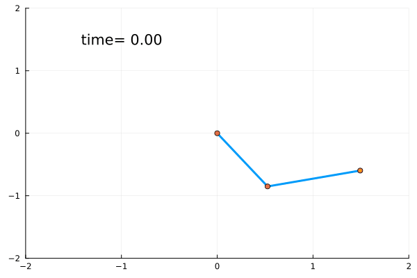

# Double Pendulum Model

An undamped double pendulum can be constructed using the [`DoublePendulum`](@ref) function, as shown below.
Models are provided for the fully-actuated version, the undriven version, and both of the underactuated versions (also accessible via the convenience functions [`Acrobot`](@ref) and [`Pendubot`](@ref)).
Additionally, when also using the Plots.jl package, the convenience plotting function [`plot_double_pendulum`](@ref) is provided.



```@docs
DoublePendulum
control_double_pendulum
get_double_pendulum_state_symbols
get_double_pendulum_param_symbols
Acrobot
Pendubot
```

## Copy-Pastable Code

```@example plot_double_pendulum
using Random; Random.seed!(200) # hide
using ModelingToolkit, NeuralLyapunovProblemLibrary, Plots, OrdinaryDiffEq

@named double_pendulum_undriven = DoublePendulum(; actuation = :undriven)
double_pendulum_undriven = structural_simplify(double_pendulum_undriven)

# Assume uniform rods of random mass and length
m1, m2 = ones(2)
l1, l2 = ones(2)
lc1, lc2 = l1 /2, l2 / 2
I1 = m1 * l1^2 / 3
I2 = m2 * l2^2 / 3
g = 1.0
p = [I1, I2, l1, l2, lc1, lc2, m1, m2, g]

x = get_double_pendulum_state_symbols(double_pendulum_undriven)
x0 = Dict(x .=> vcat(2π * rand(2) .- π, zeros(2)))

params = get_double_pendulum_param_symbols(double_pendulum_undriven)
p_dict = Dict(parameters(double_pendulum_undriven) .=> p)

prob = ODEProblem(double_pendulum_undriven, x0, 100, p_dict)
sol = solve(prob, Tsit5())

gif(plot_double_pendulum(sol, p); fps=50)
```

## Plotting the Double Pendulum

```@docs
plot_double_pendulum
```