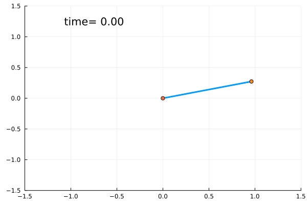

# Pendulum Model

A simple damped pendulum can be constructed using the [`Pendulum`](@ref) function, as shown below.
Additionally, when also using the Plots.jl package, the convenience plotting function [`plot_pendulum`](@ref) is provided.



```@docs
Pendulum
```

## Copy-Pastable Code

```@example plot_pendulum
using Random; Random.seed!(200) # hide
using ModelingToolkit, NeuralLyapunovProblemLibrary, Plots, OrdinaryDiffEq

x0 = [π * rand(), -π * rand()]
p = [0.5, 1]

@named pendulum = Pendulum(driven = false)
pendulum = structural_simplify(pendulum)
prob = ODEProblem(pendulum, x0, 15, p)
sol = solve(prob, Tsit5())

gif(plot_pendulum(sol); fps=50)
```

## Plotting the Pendulum

```@docs
plot_pendulum
```
