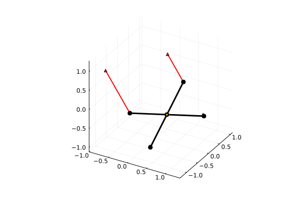

# Quadrotor Models

Two versions of the quadrotor are provided: a planar approximation ([`QuadrotorPlanar`](@ref)) and a 3D model ([`Quadrotor3D`](@ref)).
Additionally, when also using the Plots.jl package, the convenience plotting functions [`plot_quadrotor_planar`](@ref) and [`plot_quadrotor_3d`](@ref) are provided.

```@contents
Pages = ["quadrotor.md"]
Depth = 2:3
```

## Planar Approximation

The planar quadrotor ([`QuadrotorPlanar`](@ref), technically a birotor) is a rigid body with two rotors in line with the center of mass.


```@docs
QuadrotorPlanar
```

### Copy-Pastable Code

```@example plot_quadrotor_planar
using Random; Random.seed!(200) # hide
using ModelingToolkit
using NeuralLyapunovProblemLibrary
using OrdinaryDiffEq
using Plots
using LinearAlgebra
using ControlSystemsBase: lqr, Continuous

@named quadrotor_planar = QuadrotorPlanar()

function π_lqr(p; x_eq = zeros(6), Q = I(6), R = I(2))
    m, I_quad, g, r = p

    # Assumes linearization around a fixed point
    # x_eq = (x*, y*, 0, 0, 0, 0), u_eq = (mg / 2, mg / 2)
    A_lin = zeros(6, 6)
    A_lin[1:3,4:6] .= I(3)
    A_lin[4,3] = -g

    B_lin = zeros(6, 2)
    B_lin[5,:] .= 1 / m
    B_lin[6,:] .= r / I_quad, -r / I_quad

    K = lqr(Continuous, A_lin, B_lin, Q, R)

    T0 = m * g / 2
    return (x) -> -K * (x - x_eq) + [T0, T0]
end

t, = independent_variables(quadrotor_planar)
Dt = Differential(t)

params = [quadrotor_planar.m, quadrotor_planar.I_quad, quadrotor_planar.g, quadrotor_planar.r]
q = [quadrotor_planar.x, quadrotor_planar.y, quadrotor_planar.θ]
u = [quadrotor_planar.u1, quadrotor_planar.u2]
x = vcat(q, Dt.(q))

# Assume rotors are negligible mass when calculating the moment of inertia
m, r = ones(2)
g = 1.0
I_quad = m * r^2 / 12
p = [m, I_quad, g, r]

# Create controller system and combine with quadrotor_planar, then simplify
@named lqr_controller = ODESystem(
    u .~ π_lqr(p)(x),
    t,
    vcat(x, u),
    params
)
@named quadrotor_planar_lqr = compose(lqr_controller, quadrotor_planar)
quadrotor_planar_lqr = structural_simplify(quadrotor_planar_lqr)

# Random initialization
# structural_simplify sometimes rearranges variables, so we use a Dict to provide the
# initialization and parameters when constructing the ODEProblem
x0 = Dict(x .=> 2 * rand(6) .- 1)
p = Dict(params .=> [m, I_quad, g, r])
τ = sqrt(r / g)

prob = ODEProblem(quadrotor_planar_lqr, x0, 15τ, p)
sol = solve(prob, Tsit5())

gif(
    plot_quadrotor_planar(
        sol,
        [m, I_quad, g, r];
        x_symbol=q[1],
        y_symbol=q[2],
        θ_symbol=q[3],
        u1_symbol=u[1],
        u2_symbol=u[2]
    );
    fps = 50
)
```

### Plotting the Planar Quadrotor

```@docs
plot_quadrotor_planar
```

## 3D Model

A full 3D model from [quadrotor](@cite) is provided via [`Quadrotor3D`](@ref).



```@docs
Quadrotor3D
```

### Copy-Pastable Code

```@example plot_quadrotor_3d
using Random; Random.seed!(200) # hide
using ModelingToolkit
import ModelingToolkit: inputs
using NeuralLyapunovProblemLibrary
using OrdinaryDiffEq
using Plots
using LinearAlgebra
using ControlSystemsBase: lqr, Continuous

# Define LQR controller
function π_lqr(p; x_eq = zeros(12), u_eq = [p[1]*p[2], 0, 0, 0], Q = I(12), R = I(4))
    @named quadrotor_3d = Quadrotor3D()

    # Use equilibrium as linearization point
    u = inputs(quadrotor_3d)
    x = setdiff(unknowns(quadrotor_3d), u)
    params = parameters(quadrotor_3d)
    op = Dict(vcat(x .=> x_eq, u .=> u_eq, params .=> p))

    # Linearize with ModelingToolkit
    mats, sys = linearize(quadrotor_3d, u, x; op)

    # Sometimes linearization will reorder the variables, but we can undo that with
    # permutation matrices Px : x_new = Px * x and Pu : u_new = Pu * u
    x_new = unknowns(sys)
    u_new = inputs(sys)

    Px = (x_new .- x') .=== 0
    Pu = (u_new .- u') .=== 0

    A_lin = Px' * mats[:A] * Px
    B_lin = Px' * mats[:B] * Pu

    K = lqr(Continuous, A_lin, B_lin, Q, R)
    return (x) -> -K * (x - x_eq) + u_eq
end

@named quadrotor_3d = Quadrotor3D()

# Set up variable symbols
t, = independent_variables(quadrotor_3d)
Dt = Differential(t)

x = [
    quadrotor_3d.x,
    quadrotor_3d.y,
    quadrotor_3d.z,
    quadrotor_3d.φ,
    quadrotor_3d.θ,
    quadrotor_3d.ψ,
    quadrotor_3d.vx,
    quadrotor_3d.vy,
    quadrotor_3d.vz,
    quadrotor_3d.ωφ,
    quadrotor_3d.ωθ,
    quadrotor_3d.ωψ
]

u = [
    quadrotor_3d.T,
    quadrotor_3d.τφ,
    quadrotor_3d.τθ,
    quadrotor_3d.τψ
]

params = [
    quadrotor_3d.m,
    quadrotor_3d.g,
    quadrotor_3d.Ixx,
    quadrotor_3d.Ixy,
    quadrotor_3d.Ixz,
    quadrotor_3d.Iyy,
    quadrotor_3d.Iyz,
    quadrotor_3d.Izz
]

# Assume rotors are negligible mass when calculating the moment of inertia
m, L = ones(2)
g = 1.0
Ixx = Iyy = m * L^2 / 6
Izz = m * L^2 / 3
Ixy = Ixz = Iyz = 0.0
p = [m, g, Ixx, Ixy, Ixz, Iyy, Iyz, Izz]

# Create controller system and combine with quadrotor_3d, then simplify
@named lqr_controller = ODESystem(
    u .~ π_lqr(p)(x),
    t,
    vcat(x, u),
    params
)

@named quadrotor_3d_lqr = compose(lqr_controller, quadrotor_3d)
quadrotor_3d_lqr = structural_simplify(quadrotor_3d_lqr)

# Random initialization
# structural_simplify sometimes rearranges variables, so we use a Dict to provide the
# initialization and parameters when constructing the ODEProblemp = Dict(params .=> p)
δ = 0.5
x0 = Dict(x .=> δ .* (2 .* rand(12) .- 1))
τ = sqrt(L / g)
p = Dict(params .=> [m, g, Ixx, Ixy, Ixz, Iyy, Iyz, Izz])

prob = ODEProblem(quadrotor_3d_lqr, x0, 15τ, p)
sol = solve(prob, Tsit5())

gif(
    plot_quadrotor_3d(
        sol,
        [m, g, Ixx, Ixy, Ixz, Iyy, Iyz, Izz];
        x_symbol=x[1],
        y_symbol=x[2],
        z_symbol=x[3],
        φ_symbol=x[4],
        θ_symbol=x[5],
        ψ_symbol=x[6],
        T_symbol=u[1],
        τφ_symbol=u[2],
        τθ_symbol=u[3],
        τψ_symbol=u[4]
    );
    fps=50
)
```

### Plotting the 3D Quadrotor

```@docs
plot_quadrotor_3d
```

### References
```@bibliography
Pages = ["quadrotor.md"]
```